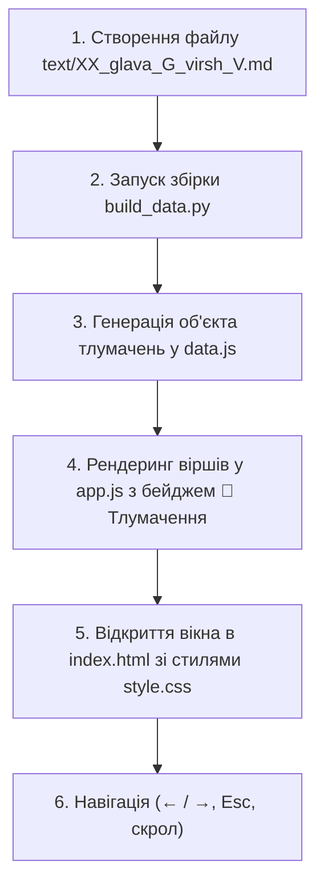

# Інструкція з підготовки та структурування файлів для папки `text/`

Цей документ визначає стандартизований регламент обробки транскриптів лекцій, перекладу українською мовою та створення структурованих файлів тлумачень до книги «Притчі царя Соломона».

---

## 📌 Загальна мета
Перетворити потік усного виступу / лекції на серію структурованих, легких для сприйняття та глибоких навчальних матеріалів до кожного окремого вірша або смислового блоку.

---

## 🛠 Покроковий алгоритм підготовки

### Крок 1. Аналіз вхідного матеріалу
1. **Визначення діапазону віршів:** Визначити, яку главу та які саме вірші (від і до) охоплює наданий фрагмент лекції.
2. **Сегментація по віршах:** Розділити суцільний транскрипт на логічні частини, що відповідають конкретним уривкам притч (наприклад, вірші 1–6 = 6 окремих файлів).

---

### Крок 2. Правила іменування файлів
Усі файли зберігаються в папці `text/` за чіткою схемою:
```text
text/{порядковий_номер}_{glava_X}_{virsh_Y}.md
```
* **Приклади:**
  - `text/01_glava_1_virsh_1.md`
  - `text/02_glava_1_virsh_2.md`
  - `text/07_glava_1_virsh_7.md`
  - `text/34_glava_2_virsh_1.md`

---

### Крок 3. Переклад та стилістична адаптація
1. **Мова:** Виключно якісна літературна українська мова.
2. **Очищення усного мовлення:**
   - Видалити слова-паразити, повтори, технічні ремарки транскрипції (`[сміх]`, `[відкашлюється]`, організаційні оголошення тощо).
   - Зберегти живе пояснення, метафори та життєві приклади лектора, виклавши їх лаконічно й послідовно.
3. **Термінологія івриту:**
   - Зберігати оригінальні івритські поняття з транслітерацією та обов'язковим перекладом (наприклад: *Машаль* — приклад/алегорія, *Хохма* — мудрість, *Мусар* — моральна дисципліна, *Даат* — усвідомлене пізнання, *Біна* — аналітична логіка, *Тахбулот* — стратегії/комбінації).

---

### Крок 4. Канонічна структура кожного файлу
Кожен файл у папці `text/` повинен мати уніфіковану розмітку:

```markdown
# Глава {Номер}, Вірш {Номер}: {Коротка суть / Головна тема}

> **«{Канонічний український текст вірша}»**  
> *({Транслітерація ключової фрази на івриті або оригінал})*

---

## 📖 Суть та тлумачення уривка

### 1. {Перший ключовий концепт / Символіка / Корінь слова}
* Розбір термінів і першоджерел.
* Пояснення фундаментального духовного закону.

### 2. {Пояснення коментаторів (Малбім, Віленський Ґаон тощо)}
* Психологічний або кабалістичний зріз уривка.
* Причинно-наслідкові зв'язки.

### 3. {Практичні приклади, метафори та коучинг}
* Життєві ситуації, що пояснюють дію правила в сучасному світі.
* Аналогії (наприклад: шахи, музика, механізми впливу).

### 4. {Практичне втілення в життя (Actionable Takeaway)}
* Що саме потрібно робити або змінити у мисленні згідно з цим віршем.
```

---

## 📋 Чек-лист перевірки якості перед збереженням
- [ ] Файл поміщено в папку `text/` з правильним числовим префіксом.
- [ ] Цитата вірша відповідає українському перекладу Біблії.
- [ ] Текст структуровано за допомогою підзаголовків `###`, списків та жирного виділення.
- [ ] Усунуто весь шум усного мовлення, але збережено яскраві приклади автора.
- [ ] Пояснено всі ключові духовні та психологічні терміни.

---

## 🪟 Порядок створення та підключення модальних вікон тлумачень

Усі файли тлумачень з папки `text/` автоматично інтегруються у веб-інтерфейс у вигляді інтерактивних модальних вікон. Нижче описано повний цикл: від створення `.md` файлу до його відображення на сайті.



---

### 1. Архітектура та принцип прив'язки даних
1. **Ключ зв'язку:** Зв'язок між біблійним віршем та тлумаченням будується за ключем `"{номер_глави}-{номер_вірша}"` (наприклад, `1-1`, `1-6`, `2-4`).
2. **Іменування файлу:** Назва файлу в `text/` обов'язково повинна містити шаблон `glava_{G}_virsh_{V}.md`. За цим патерном парсер автоматично визначає, до якого вірша відноситься текст.

---

### 2. Автоматична збірка та парсинг (`build_data.py`)
Після додавання або редагування файлів у `text/` запускається скрипт збірки:
```bash
python3 build_data.py
```

**Що робить скрипт:**
* Знаходить усі `.md` файли в папці `text/`.
* Витягує номер глави та вірша за допомогою регулярного виразу `glava_(\d+)_virsh_(\d+)`.
* Конвертує розмітку Markdown у семантичний HTML (`#` -> `<h2>`, `##` -> `<h3>`, `###` -> `<h4>`, `>` -> `<blockquote>`, `*` -> `<ul><li>`, жирний текст, курсив тощо).
* Генерує/оновлює файл `data.js`, записуючи в `window.SOLOMON_DATA.commentaries` ключ-значення:
  ```javascript
  commentaries: {
    "1-1": "<h2>Глава 1, Вірш 1...</h2><blockquote>...</blockquote>...",
    "1-2": "<h2>Глава 1, Вірш 2...</h2>..."
  }
  ```

---

### 3. Структура розмітки модального вікна (`index.html`)
Модальне вікно розміщується в кінці `<body>` і має наступну структуру:

```html
<div id="commentary-modal" class="modal-overlay hidden" role="dialog" aria-modal="true" aria-labelledby="modal-verse-ref">
  <div class="modal-container">
    <!-- Шапка модального вікна -->
    <header class="modal-header">
      <div class="modal-header-info">
        <span class="modal-badge">Тлумачення</span>
        <h3 id="modal-verse-ref">Притчі 1:1</h3>
      </div>
      <button id="btn-close-modal" class="btn-icon" aria-label="Закрити вікно">✕</button>
    </header>

    <!-- Тіло з прокруткою контенту -->
    <div id="commentary-modal-content" class="modal-body markdown-body">
      <!-- Сюди динамічно вставляється скомпільований HTML -->
    </div>

    <!-- Підвал із навігацією між доступними коментарями -->
    <footer class="modal-footer">
      <button id="btn-modal-prev" class="btn btn-outline">← Попередній коментар</button>
      <button id="btn-modal-next" class="btn btn-primary">Наступний коментар →</button>
    </footer>
  </div>
</div>
```

---

### 4. Стилізація та візуальні вимоги (`style.css`)
1. **Оверлей:** Фіксоване позиціонування (`fixed`, `inset: 0`), затемнення фону з розмиттям (`backdrop-filter: blur(8px)`), високий `z-index: 1000`.
2. **Контейнер картки:** Максимальна ширина `760px`, плавні заокруглені кути (`border-radius: 16px`), тінь глибини (`box-shadow`), адаптивна висота (`max-height: 85vh`).
3. **Скрол-зона:** Внутрішня область `.modal-body` має `overflow-y: auto` з кастомним елегантним скролбаром.
4. **Індикація вірша з тлумаченням у списку:**
   - Елемент вірша отримує клас `.has-commentary-item` (акцентна золота лінія зліва або м'яке підсвічування).
   - Відображається кнопка-бейдж `.btn-commentary-badge` з іконкою книги та підписом «📖 Тлумачення».
5. **Типографіка Markdown:** Окремі стилі для `blockquote`, маркованих списків `ul/li`, підзаголовків `h2-h4` та виділень термінів.

---

### 5. Логіка взаємодії та подій (`app.js`)

#### А. Рендеринг віршів
Під час побудови списку віршів перевіряється наявність ключа в `data.commentaries`:
```javascript
const commKey = `${currentChapter}-${verseNumber}`;
const hasComm = !!(solomonData.commentaries && solomonData.commentaries[commKey]);
if (hasComm) {
  // додаємо клас has-commentary-item та кнопку .btn-commentary-badge
}
```

#### Б. Відкриття модального вікна (`openCommentaryModal`)
1. Отримує номер глави та вірша.
2. Вставляє скомпільований HTML у `#commentary-modal-content`.
3. Оновлює заголовок: `Притчі {глава}:{вірш}`.
4. Визначає наявність попереднього та наступного доступного коментаря в книзі, оновлюючи стан кнопок `#btn-modal-prev` та `#btn-modal-next`.
5. Знімає клас `.hidden` з `#commentary-modal` та блокує прокрутку основного документа (`document.body.style.overflow = 'hidden'`).

#### В. Закриття модального вікна (`closeCommentaryModal`)
Закриття повинно спрацьовувати у трьох випадках:
1. Клік на кнопку-хрестик `#btn-close-modal`.
2. Клік за межами вікна картки (по темному оверлею).
3. Натискання клавіші `Escape` на клавіатурі.
При закритті відновлюється скрол сторінки (`document.body.style.overflow = ''`).

#### Г. Навігація між коментарями
* Кнопки підвалу та стрілки клавіатури (`←` / `→`) дозволяють переходити до попереднього/наступного вірша, для якого є тлумачення, без необхідності повертатися до загального списку.

---

### 6. Порядок дій для додавання нових модальних вікон (Пам'ятка)
1. **Підготувати новий файл:** створити `text/07_glava_1_virsh_7.md` згідно зі стандартами.
2. **Перезібрати дані:** виконати `python3 build_data.py`.
3. **Перевірити в браузері:** вірш автоматично отримає золотистий маркер і кнопку «📖 Тлумачення», а при кліку відкриється стилізоване модальне вікно.

